# Instructions
J.C. Sciaccotta 1983083

**TODO:** Add your screen captures to a new directory called [images](images).

**HINT:** Embed your screen captures as requested in the sections below. You can embed the image using the following syntax:

```

```

The first argument is the Alt-text for the image. The second argument is the path to the image. Make sure your images are readable and that you save them in a JPG or PNG format.

HW5

Your GitHub account showing that is has been forked from the depaulcdm/spring- petclinic repository. This doesn’t actually need an image – I can see it from your repository.

Your GitHub Actions dashboard showing a successful first build.
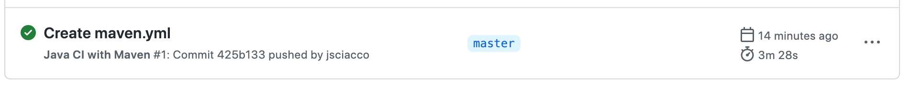

Your GitHub repository with the readme.md file selected showing the code that you changed to update the badge.
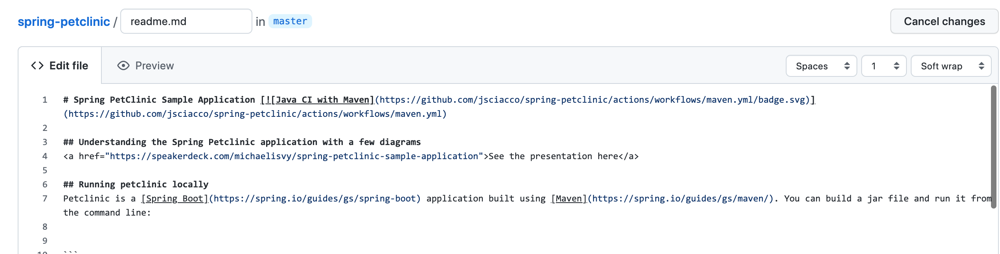

Your GitHub repository with the readme.md file selected showing the build success status after you’ve updated the badge markdown.
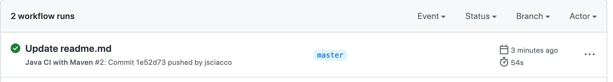
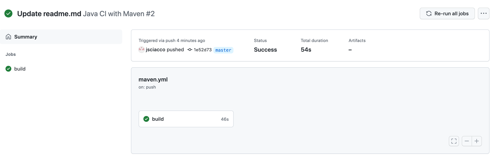
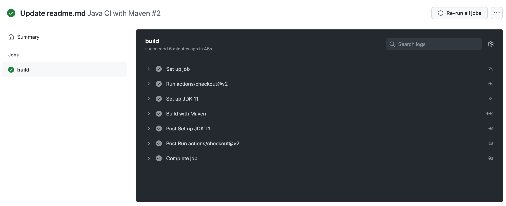

The section of the POM file showing the coordinates after you’ve commented them out.
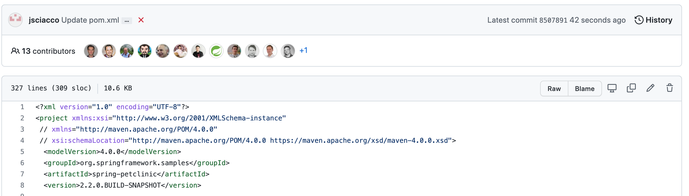

Your GitHub Actions dashboard showing the unsuccessful build after the breaking change.
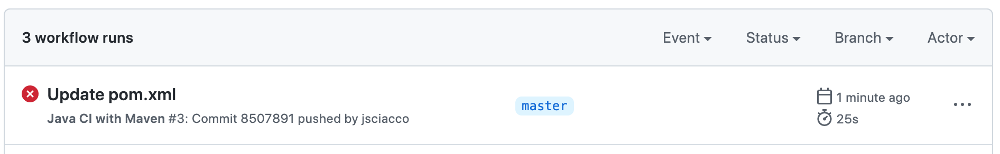

Your GitHub repository with the readme.md file selected showing the build failed status after the GitHub workflow fails.
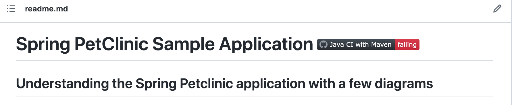

The section of the POM file showing the coordinates after you’ve fixed them.
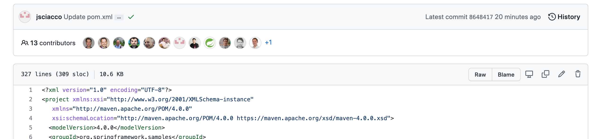

Your GitHub Actions dashboard showing the successful build after the breaking change has been fixed.
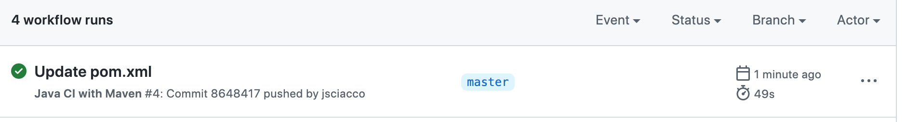

Your GitHub repository with the readme.md file selected showing the build success status after the GitHub workflow has recovered.
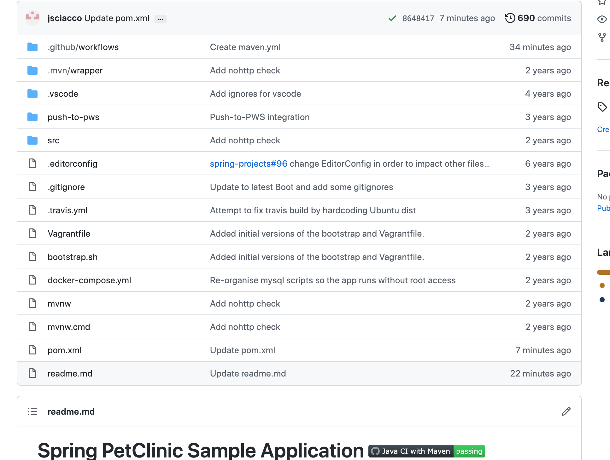

DOCKER

Your dockerfile. Please provide a link to this file rather than a screen capture.

https://github.com/jsciacco/spring-petclinic/blob/master/dockerfile 

Your running docker instance as shown by a ps command.
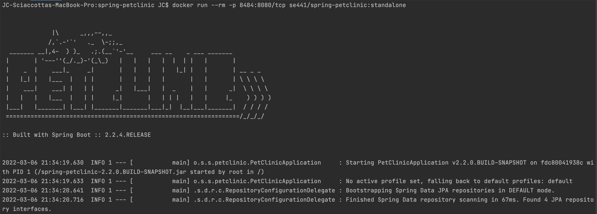

Your browser accessing the main page of the website from your local container.
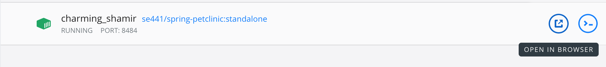
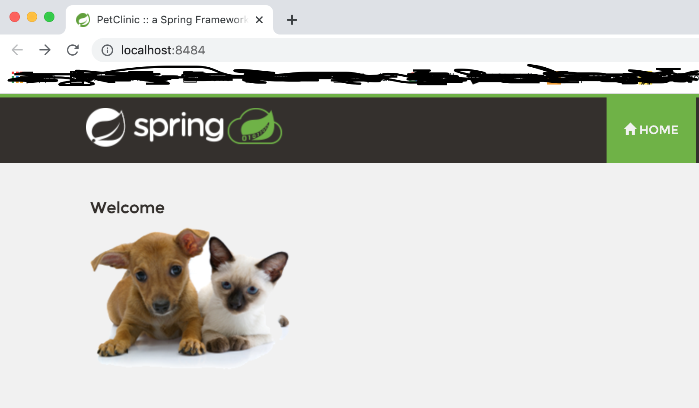

DOCKER COMPOSE - MYSQL ONLY

The output from the docker-compose up command.
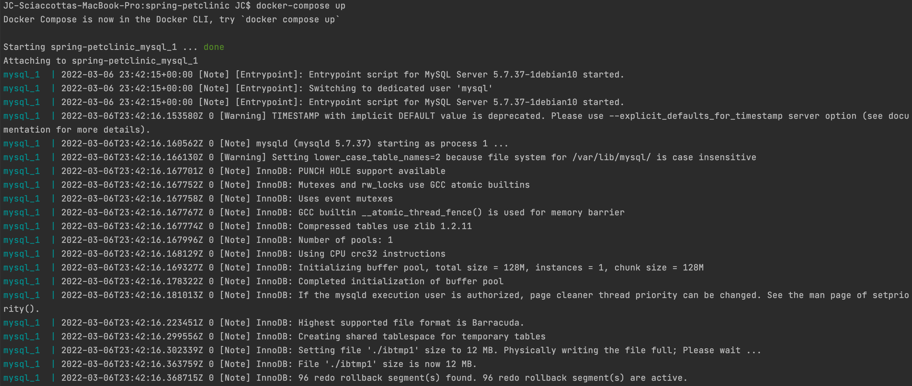

Your browser accessing the “Veterinarians” page of the website from your local container when you run the application from the host system.
![Docker access vet]

A section of the stack trace generated when you attempt to run the application container that has been updated to use MySQL.
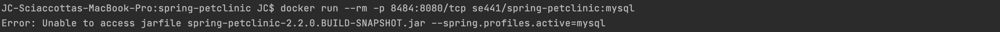

DOCKER COMPOSE - APP SERVER AND MYSQL

Your updated docker-compose.yml file containing the application server, built from your local Dockerfile, and the existing MySQL configuration.
Please provide a link to this file rather than a screen capture.

https://github.com/jsciacco/spring-petclinic/blob/master/docker-compose.yml

Your updated application-mysql.properties file containing the URL change for the database server. Please provide a link to this file rather than a screen capture.

https://github.com/jsciacco/spring-petclinic/blob/master/src/main/resources/application-mysql.properties

The output from the docker-compose up command.


Your browser accessing the “Veterinarians” page of the website from your local container.

